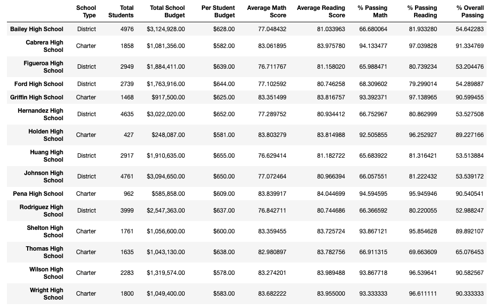

# School District Analysis

## Overview of Project

After a completing an initial analysis of data from 15 schools in a district to assess students' testing performance in math and reading based on grade, school, type of school and budget, the school board asked for follow up research to determine the impact that potentially altered testing scores from Thomas High School's ninth grade class may have had on overall results. 

In order to determine the changes between the initial results that included the potentially altered testing scores and the results without them, I had to remove the reading and math scores for ninth graders from Thomas High School and run the analysis again for updated results. *Note: The scores had to be replaced with nulls, as zeros would be calculated as part of the data and obscure the results. 

## Results

The district posed **four** major questions about the overall results once the ninth grade reading and math scores were removed from the data set. 

#### How is the district summary affected?

The differences in the district summary from the initial analysis and the one after nulling ninth grade data from Thomas High School was relatively small: 
* The average math score decreased by .1. 
* The average reading score remained the same. 
* The percentage of people who passed math and reading decreased by one percentage point, respectively. 
* The percentage of people who both reading and math decreased by one percentage point. 

**Before (with Thomas High School)**

**After (without Thomas High School)**

#### How is the school summary affected?

The only part of the school summary that was impacted was Thomas High School's average reading and math scores and passing rates: 
* The average reading and math scores saw minor declines of less than one point each. 
* The passing rates, however, experienced major declines: 
    * The math passing rate went from 93.3% to 66.9%
    * The reading passing rate went from 97.3% to 69.7%
    * The overall passing rate went from 90.9% to 65.1%

**Before (with Thomas High School)**

**After (without Thomas High School)**

#### How does replacing the ninth graders’ math and reading scores affect Thomas High School’s performance relative to the other schools?

As found in the school summary above, nulling the ninth graders' testing scores, drove a major decline in Thomas High School's performance relative to other schools and handily knocked it out of the top five schools where it previously placed second. 

#### How does replacing the ninth-grade scores affect the following:
* Math and reading scores by grade
    * Average math scores decreased from 83.6 to 68.5
    * Average reading scores decreased from 83.7 to 69.0
* Scores by school spending
    * The average scores by school spending were mostly unchanged, though the average math score for schools with per capita budgets of $630-644 droped 0.1 points in the average math score. 
* Scores by school size
    * Scores by school size were also mostly unchanged -- the average math and reading scores for medium-sized (1,000-2,000 students) schools dropped less than .1 point. 
* Scores by school type
    * As Thomas High is a charter school, the charter school category saw drops in average math score (-.01), percentage passing math (-4 percentage points), percentage passing reading (-4 percentage points) and percentage passing overall (-3 percentage points. The average reading score was the only metric that was relatively unchanged. 

## Summary

As stated throughout the results, nulling the ninth grade reading and math scores above 70 (those who passed), impacted almost every metric of our analysis, including the district summary, school summary, Thomas High's overall performance and performance results based on school spending and school type. 